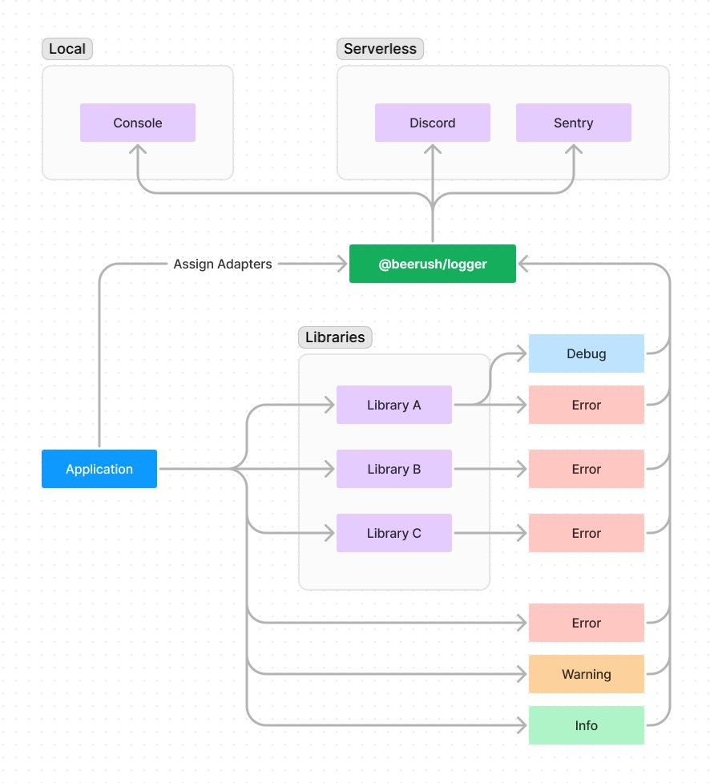

# @beerush/logger: Unify Your JavaScript Logging Experience

Welcome to @beerush/logger - where consistency in logging across Libraries, Frameworks, and Applications becomes a
reality. This versatile logger, free of dependencies, is designed to standardize logging, offering a range of adaptable
adapters tailored to different environments. Embrace a unified approach to all levels of logging with @beerush/logger.
Start simplifying your logging process today!



## 🐞 Background

The Javascript ecosystem is remarkably rich with a vast selection of libraries and frameworks. However, managing the
display and distribution of logs can pose a significant challenge.

Within a development environment, it might be preferable to log everything. However, in production, logging may need to
be limited to errors only. It is particularly important to streamline this process when you are deploying your project
to a serverless environment or any other cloud service where debugging can be complicated.

The straightforward console.log might suffice for your project, but it does not offer control over logging for the
library or framework in use. Our library aims to address this by providing a simple, user-friendly logger that can be
employed across various environments.

Every library, framework, and application can utilize the same logger for consistency and efficiency. Moreover, this
allows for control over the log level and the destination of the logs.

## ⛩️ Installation

You can install the package via package manager such as bun, npm, or yarn.

```bash
bun add @beerush/logger
```

## 🪄 Usage

You can use it in your typescript files like shown below:

**Initialization** in `./logger.ts`

```typescript
import { createLogger, LogLevel } from '@beerush/logger';
import { consoleAdapter } from '@beerush/logger/console';

// Create a new logger instance and export it for use in other modules.
export const logger = createLogger();

// Use the console adapter to log to the console.
logger.use(consoleAdapter());

logger.info('Hello, World!'); // Logs an informational message.
```

```bash Console Output
📜 [5/9/2024, 2:07:14 PM] Hello, World!
```

You can also reuse the logger in your application. For instance, in your app.ts file:

**Logging** in `./app.ts`

```typescript
import { logger } from './logger.ts';

logger.info('Hello, World! App is running on port 3000.'); // Logs an informational message.
```

```bash Console Output
📜 [5/9/2024, 2:07:14 PM] Hello, World! App is running on port 3000.
```

### Adapters

Adapter is a function that receives a log and handles it in a specific way. For example, an adapter might send the log
to a remote server, write it to a file, or log it to the console.

Each adapter can have its own severity level and options. For example, the Console adapter will capture all logs in
development, but nothing in production, and the Sentry adapter will capture WARNING and ERROR in production, but nothing
in development.

You can add an adapter to a logger using the `use`
method of the logger.


> Adapters are applied in the order they are added, and shared across all loggers created from the same logger.

> Using the same adapter multiple times will overwrite the previous one.

**Example:**

```typescript
import { logger } from './logger.ts';
import { consoleAdapter } from '@beerush/logger/console';
import { fileAdapter } from '@beerush/logger/adapters/file';

logger.use(consoleAdapter({ level: LogLevel.DEBUG })); // Register a console adapter.
logger.info('Hello, World!'); // Logs an informational message to the console.
logger.verbose('Detailed information!'); // Ignored because the log level is DEBUG.

logger.use(fileAdapter({ location: './logs', level: LogLevel.ERROR })); // Register a file adapter.
logger.error('An error occurred!'); // Logs an error message to the console and to a file.
logger.info('Hello, World!'); // Logs to the console, and logs to a file is ignored because the log level is ERROR.
```

### Log Levels

The logger supports various log levels, each with its own significance. The log levels are as follows:

* **ERROR**: This level is used for error messages. These logs represent errors that might have allowed the application
  to continue running, but with unexpected behavior.
* **WARN**: This level is used for potentially harmful situations. These logs might lead to an error.
* **INFO**: This level is used for informational messages. These logs represent the progress of the application.
* **DEBUG**: This level is used for general debugging information. These logs are usually only needed for debugging.
* **VERBOSE**: This level is used for detailed debugging information. These logs are usually only needed for debugging.

### Log Tracking

The logger supports tracking logs. Tracking logs are useful for tracking the execution of a specific part of the code.
This is useful for debugging and analytics. You can track logs using the `track` method of the logger.

> Tracking logs are not logged to the console by default. You can use specific adapters to log tracking logs.

**Example:**

```typescript
import { logger } from './logger.ts';

logger.track('User logged in', { userId: 1 }); // Track a user login.
```

### Log Colors

The console adapter uses different colors for different log levels when logging to the console. The colors are as
follows:

* **VERBOSE**: Purple
* **DEBUG**: Blue
* **INFO**: Green
* **WARN**: Yellow
* **ERROR**: Red

### Log Format

The logger formats the logs in a specific way when logging to the console. The format is as follows:

* If the log message is a string, it is prefixed with a specific emoji based on the log level.
* If the log message is not a string, it is logged as is.
* If the log has an error, it is logged after the message.
* If the log has extra information, it is logged after the error (if any).

### Log Tags

The logger supports tagging logs. Tags are useful for categorizing logs. For example, you might want to tag logs with
the name of the module they are coming from. You can create a new logger with specific tags using the `create` method of
an existing logger.

**Example:**

```typescript
import { logger } from './logger.ts';

const moduleLogger = logger.create({ tags: ['module'] });
moduleLogger.info('Hello, World!'); // Logs an informational message with the tag 'module'.
```

```bash Console Output
📜 [module][5/9/2024, 2:07:14 PM] Hello, World!
```

### Conditional Adapter

You may want to adjust the log level based on your environment. For example, in your **Hono** app, you might want to
disable console logging in production. You can create a middleware that adjusts the log level based on the environment
as shown below:

```typescript
import { logger } from './logger.ts';
import type { Context } from 'hono';

export default async function loggerMiddleware(ctx: Context, next: () => void) {
  // Override the logger level based on the environment.
  if (ctx.env.PRODUCTION) {
    logger.use(consoleAdapter({ level: LogLevel.OFF }));
  } else {
    logger.use(consoleAdapter({ level: LogLevel.DEBUG }));
  }

  ctx.set('logger', logger);
  await next();
}
```

### Custom Adapter

In case you want to log your data to an external service which is not supported by the built-in adapters, you can create
a custom adapter. A custom adapter is an object with a `name` and an `emit` method. The `emit` method is called with the
log object when a log is emitted. You can create a custom adapter as shown below:

```typescript
import type { Log } from '@beerush/logger';
import { logger } from './logger.ts';

logger.use({
  name: 'custom-adapter',
  emit: async (log: Log) => {
    await fetch('https://example.com/log', {
      method: 'POST',
      body: JSON.stringify(log),
      headers: {
        'Content-Type': 'application/json'
      }
    });    
  }
});

logger.info('Hello, World!'); // This will log the message to the external service.

```

## 🗃️ Built-in Adapters

- [x] Logger module.
- [x] [Console adapter](./adapters/console/readme.md)
- [x] [Webhook adapter](./adapters/webhook/readme.md).
- [x] [File adapter](./adapters/file/readme.md).
- [x] [Sentry adapter](./adapters/sentry/readme.md).
- [ ] [Mixpanel adapter](./adapters/mixpanel/readme.md).
- [ ] [Slack adapter](./adapters/slack/readme.md).
- [ ] [Discord adapter](./adapters/discord/readme.md).

## License

The `@beerush/logger` is licensed under the MIT License, ensuring a wide range of opportunities for open source use and
further development.
